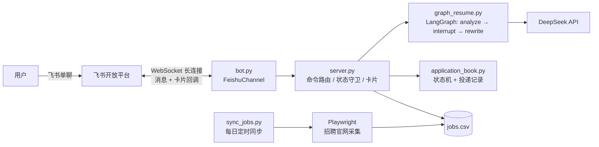

# 校招虾 🦐

> 接入飞书的个人校招求职助手：**跟踪投递进度 · 每日自动抓取岗位 · AI 按岗位改写简历**

一个从零构建的个人 Agent 项目——飞书机器人形态，LangGraph 编排 AI 工作流，Playwright 自动采集招聘官网，7×24 常驻运行。

## 它能做什么

| 能力 | 说明 |
|---|---|
| 📌 **投递进度跟踪** | `投递 公司 岗位` 记录、状态机校验推进（已投递→笔试→面试→Offer→…），非法迁移与终态变更被拒绝 |
| 🔄 **每日岗位同步** | 定时打开招聘官网（Playwright），抓岗位列表 + JD 正文，切段清洗后更新本地岗位库，全程日志兜底 |
| ✍️ **AI 改简历** | 针对某岗位：DeepSeek 先出匹配报告 → **卡片按钮人工确认** → 确认后才改写并生成带时间戳的新版本（原稿不动）|

## 架构一览



## 技术亮点

- **全长连接接入**：消息与卡片回调都走 WebSocket 长连接（新版 SDK 通道层），无需公网 IP / 域名 / HTTPS；针对飞书至少一次投递设计 `message_id` 幂等去重
- **interrupt 人机协同**：AI 改简历必须经人工确认——LangGraph `interrupt` + checkpointer 跨消息暂停/恢复，配状态守卫 + 10 分钟超时 + 卡片按钮，消除"幽灵确认"
- **采集管道双层清洗**：Playwright 渲染抓取（重试 + 等待兜底）→ 正则切出 JD 区段 →（规划）LLM 精清；兼容"岗位 id 在 DOM"与"id 在 JS"两类站点形态
- **无人值守可靠性**：单岗位抓取失败不中断整轮同步；未捕获异常写入日志再退出；开机自启 + 崩溃自启
- **pytest 护栏**：状态机结构、数据层持久化、JD 切分、合并策略等核心纯逻辑 15+ 用例覆盖

## 项目结构

```
cli/
├── bot.py               # 飞书长连接入口（消息 + 卡片回调 + 错误事件）
├── server.py            # 业务核心：命令路由、状态守卫、卡片发送、HTTP API
├── graph_resume.py      # 简历优化图（analyze → interrupt 确认 → rewrite）
├── graph_router.py      # 命令路由图（LangGraph）
├── application_book.py  # 投递记录本 + 状态机迁移表
├── resume.py            # 简历读取 + AI 简历建议
├── job_provider_moka.py # 岗位采集：列表 + JD 切分 + JSON 输出
├── sync_jobs.py         # 每日自动同步（站点清单 → 抓取 → 合并 → 日志）
├── update_jobs_csv.py   # 抓取结果合并进 jobs.csv（更新/新增双策略）
├── interrupt_demo.py / graph_demo.py   # L10/L11 教学 demo
tests/
├── conftest.py          # pytest 模块路径注入
└── test_core.py         # 核心纯逻辑测试（15+ 用例）
docs/
├── ARCHITECTURE.md      # 架构设计
├── COURSE_OUTLINE.md    # 课程大纲（本项目 = 边学边做的 14 课）
└── lessons/             # 每课文档与踩坑记录
run_bot.cmd              # Windows 一键启动（密钥从 .env 读）
```

## 快速开始

**前置**：Python 3.10+、一个飞书自建应用（事件订阅选"长连接"模式）、DeepSeek API Key。

```bat
git clone https://github.com/cliche-nomadness/job_hunter.git
cd job_hunter
python -m venv .venv
.venv\Scripts\python.exe -m pip install -r requirements.txt
```

复制 `.env.example` 为 `.env` 并填入你的凭证（**此文件已被 .gitignore 隔离，不会入库**）：

```
FEISHU_APP_ID=cli_xxx
FEISHU_APP_SECRET=xxx
FEISHU_VERIFICATION_TOKEN=xxx
DEEPSEEK_API_KEY=sk-xxx
```

准备 `jobs.csv`（表头：`公司,岗位,城市,JD,链接`，可参考 `jobs.sample.csv`），然后启动：

```bat
run_bot.cmd
```

在飞书里给机器人发消息即可（`resume.md` 放一份你自己的简历）。

## 机器人命令

| 命令 | 作用 |
|---|---|
| `投递 公司 岗位` | 记录一条投递（初始状态"已投递"）|
| `我的进度` | 列出所有投递及状态 |
| `更新 序号 状态` | 状态机校验后推进（`更新 1` 可看允许的状态）|
| `删除 序号` | 删除一条投递 |
| `岗位 城市 关键词` | 筛选岗位库 |
| `简历意见 序号` | AI 按岗位 JD 给简历匹配建议 |
| `优化简历 序号` | AI 匹配报告 → **卡片确认** → 改写生成新版本 |
| `帮助` | 命令菜单 |

## 测试

```bat
.venv\Scripts\python.exe -m pytest tests\ -v
```

覆盖：状态机迁移合法性 / 终态不可变 / 数据持久化 / 非法迁移拒绝 / JD 切分边界 / 合并策略（更新 vs 新增）。

## 开发状态

- ✅ L1–L11：CLI → 飞书接入 → LangGraph 编排 → AI 改简历（含卡片确认全链路）
- ✅ L12：Playwright 岗位采集实战（列表 + JD 切分 + JSON 产出）
- 🔄 L13：部署落地（开机自启 + 每日定时同步 + 日志兜底）
- 🔄 L14：工程化补强（git/GitHub、pytest、PostgreSQL 数据层升级）

> 本项目是"边学边做"的个人作品：每课的踩坑与设计权衡都沉淀在 [docs/lessons/](docs/lessons/)，包括读 SDK 源码定位卡片回调丢失、长连接 vs webhook 的取舍、测试抓出 JD 切分缺陷等真实过程。

## 安全说明

- 密钥只存于 `.env`（已隔离，不入库）；简历、投递记录等个人数据同样不入库
- 仓库内不含任何真实密钥与个人求职数据
