# 校招虾 🦐

> 接入飞书的个人校招求职助手：**跟踪投递进度 · 每日自动同步岗位并推送 · AI 按岗位改写简历**

一个从零构建的个人 Agent 项目——飞书机器人形态，LangGraph 编排 AI 工作流，Playwright 自动采集招聘官网，7×24 常驻运行。

## 它能做什么

| 能力 | 说明 |
|---|---|
| 📌 **投递进度跟踪** | `投递 公司 岗位` 记录、状态机校验推进（已投递→笔试→面试→Offer→…），非法迁移与终态变更被拒绝 |
| 🔄 **每日岗位同步** | 从腾讯文档智能表格生成站点清单 → Playwright 轻抓岗位列表 → 按**意向关键词过滤入库** → 飞书推送每日播报 |
| ✍️ **AI 改简历** | 针对某岗位：DeepSeek 先出匹配报告 → **卡片按钮人工确认** → 确认后才改写并生成带时间戳的新版本（原稿不动）|

## 功能演示

**接入与日常**

| 首次问好 | 命令菜单 |
|---|---|
|  | 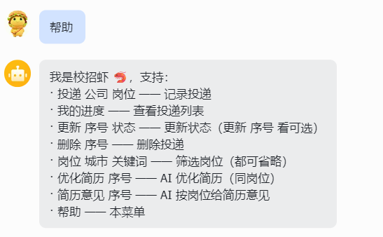 |

**投递进度跟踪**

| 投递记录 | 进度查询 |
|---|---|
| 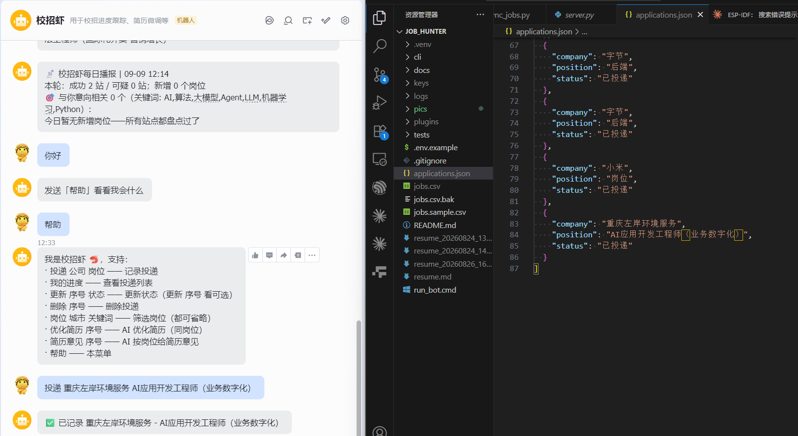 | 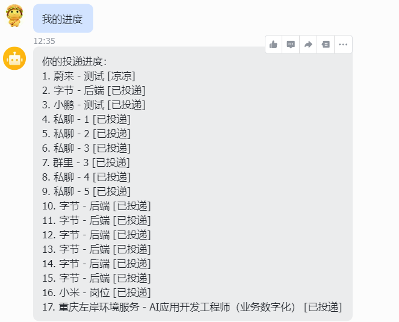 |

| 更新状态 | 删除记录（确认）| 删除记录（完成）|
|---|---|---|
| 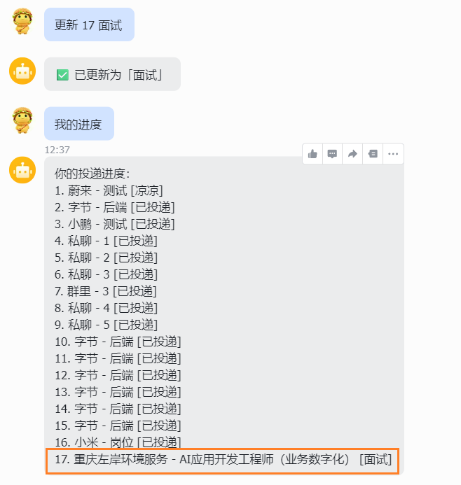 | 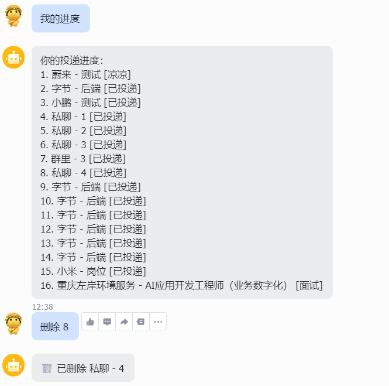 | 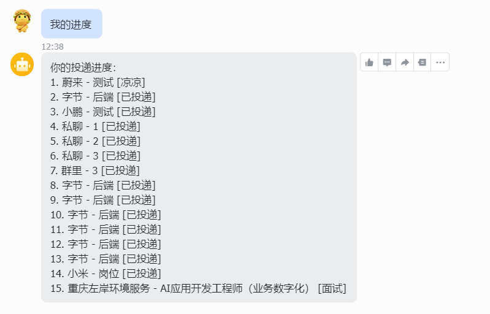 |

**每日岗位同步**

| 每日推送播报 | 岗位库展示 | 岗位筛选 |
|---|---|---|
| 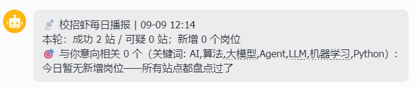 | 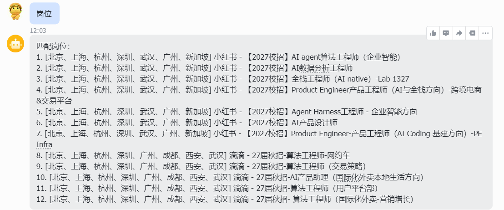 | 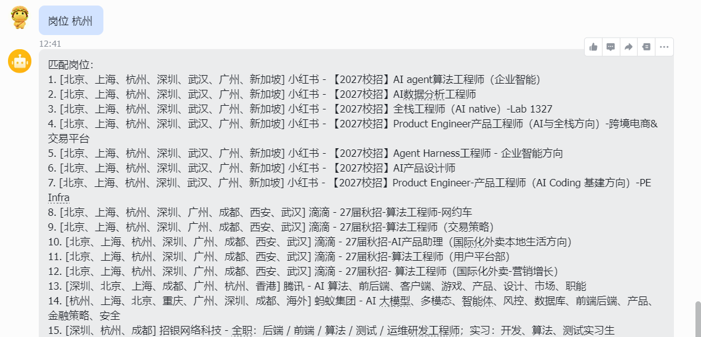 |

**AI 简历**

| 简历意见 | 优化简历（报告与确认）| 优化简历（结果）|
|---|---|---|
| 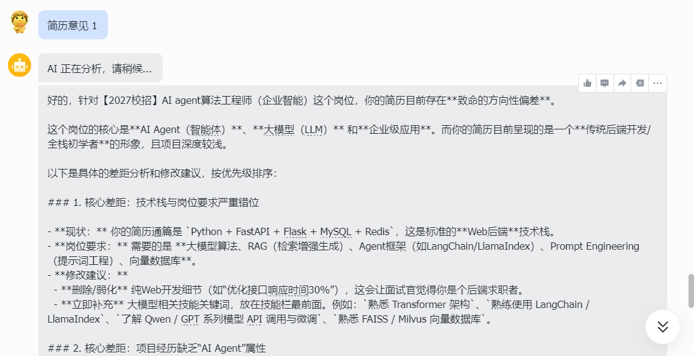 | 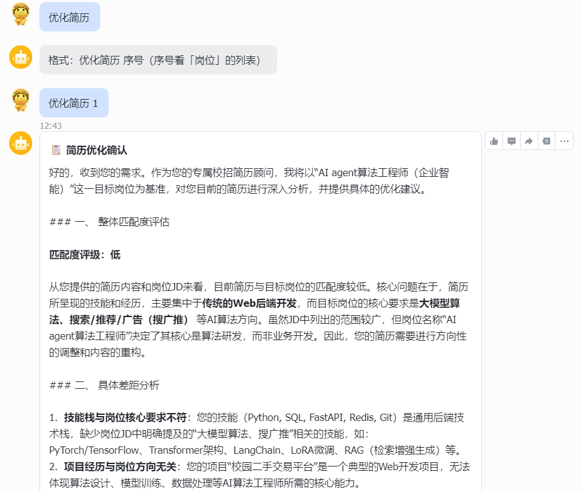 | 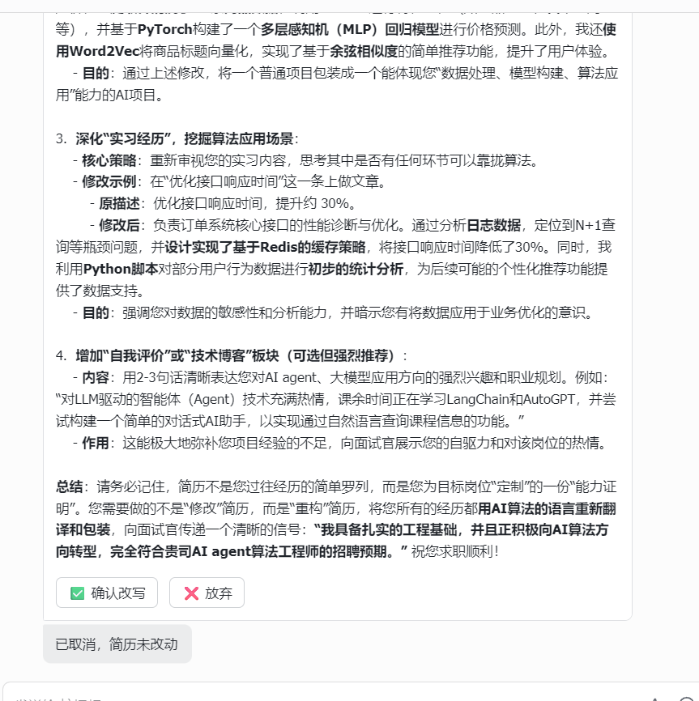 |

## 架构一览

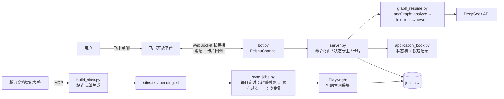

## 技术亮点

- **全长连接接入**：消息与卡片回调都走 WebSocket 长连接（新版 SDK 通道层），无需公网 IP / 域名 / HTTPS；针对飞书至少一次投递设计 `message_id` 幂等去重
- **interrupt 人机协同**：AI 改简历必须经人工确认——LangGraph `interrupt` + checkpointer 跨消息暂停/恢复，配状态守卫 + 10 分钟超时 + 卡片按钮，消除"幽灵确认"
- **采集管道**：腾讯表格 MCP 生成站点清单（同页去重 / 平台指纹分类 / 失效链接展开）→ Playwright 浏览器整轮复用 + 智能等待（数量稳定才放行）轻抓岗位列表 → **按意向关键词过滤入库**（全量抓、按需存，关键词配置于 `.env`，可自定义）
- **每日播报心跳**：同步结束自动推送"相关岗位总数 + 新增数 + Top 10 相关岗位"——每天固定收到即机器心跳，没收到即故障暴露；推送失败不影响同步本体
- **无人值守可靠性**：单站点抓取失败不中断整轮同步，每站落盘防中途崩溃丢数据；未捕获异常写入日志再退出；开机自启

## 项目结构

```
cli/
├── bot.py               # 飞书长连接入口（消息 + 卡片回调 + 错误事件）
├── server.py            # 业务核心：命令路由、状态守卫、卡片发送、HTTP API
├── graph_resume.py      # 简历优化图（analyze → interrupt 确认 → rewrite）
├── graph_router.py      # 命令路由图（LangGraph）
├── application_book.py  # 投递记录本 + 状态机迁移表
├── resume.py            # 简历读取 + AI 简历建议
├── build_sites.py       # 腾讯表格 MCP → sites.txt / pending.txt 清单生成
├── read_smartsheet.py   # 智能表格 MCP 探测与读取（被 build_sites 复用）
├── job_provider_moka.py # 岗位采集：列表轻抓 + 智能等待（Playwright）
├── sync_jobs.py         # 每日自动同步：清单 → 轻抓 → 意向过滤 → 播报推送
├── feishu_api.py        # 飞书消息发送公共模块（token 缓存 + 推送目标发现）
├── update_jobs_csv.py   # 抓取结果合并进 jobs.csv（更新/新增双策略）
├── interrupt_demo.py / graph_demo.py   # L10/L11 教学 demo
docs/
├── ARCHITECTURE.md      # 架构设计
├── COURSE_OUTLINE.md    # 课程大纲（本项目 = 边学边做的 14 课）
└── lessons/             # 每课文档与踩坑记录
run_bot.cmd              # Windows 一键启动（密钥从 .env 读）
```

## 快速开始

**前置**：Python 3.10+、一个飞书自建应用（事件订阅选"长连接"模式）、DeepSeek API Key。

```bat
git clone https://github.com/cliche-nomadness/job_hunter.git
cd job_hunter
python -m venv .venv
.venv\Scripts\python.exe -m pip install -r cli\requirements.txt
```

复制 `.env.example` 为 `.env` 并填入你的凭证（**此文件已被 .gitignore 隔离，不会入库**）：

```
FEISHU_APP_ID=cli_xxx
FEISHU_APP_SECRET=xxx
FEISHU_VERIFICATION_TOKEN=xxx
DEEPSEEK_API_KEY=sk-xxx
TENCENT_MCP_TOKEN=xxx            # 腾讯文档智能表格（岗位清单来源）
POSITION_KEYWORDS=AI,算法,大模型  # 你的求职意向关键词
```

准备 `jobs.csv`（表头：`公司,岗位,城市,JD,链接`，可参考 `jobs.sample.csv`），然后启动：

```bat
run_bot.cmd
```

在飞书里给机器人发消息即可（`resume.md` 放一份你自己的简历）。

## 每日自动同步

岗位数据来自你维护的腾讯文档智能表格（公司 / 投递链接 / 城市 / 方向摘要），生成清单后每日轻抓：

```bat
:: ① 从表格生成站点清单（--exclude 按招聘类型排除，如暑期实习）
cli\.venv\Scripts\python.exe cli\build_sites.py --exclude 暑期实习,日常实习

:: ② 同步一轮：抓岗位列表 → 意向过滤入库 → 飞书播报
cli\.venv\Scripts\python.exe cli\sync_jobs.py

:: 开发调试快速模式（秒级验证）
cli\.venv\Scripts\python.exe cli\sync_jobs.py --only 小红书,滴滴   # 只跑指定公司
cli\.venv\Scripts\python.exe cli\sync_jobs.py --limit 3            # 只跑前 3 站
```

配合 Windows 任务计划程序每天定时执行 ②，即可实现"每天 9 点自动同步 → 飞书收播报"。同步产物（`sites.txt` / `pending.txt` / `jobs.csv` / 日志）均不入库。

## 机器人命令

| 命令 | 作用 |
|---|---|
| `投递 公司 岗位` | 记录一条投递（初始状态"已投递"）|
| `我的进度` | 列出所有投递及状态 |
| `更新 序号 状态` | 状态机校验后推进（`更新 1` 可看允许的状态）|
| `删除 序号` | 删除一条投递 |
| `岗位 城市 关键词` | 筛选岗位库 |
| `简历意见 序号` | AI 按岗位 JD 给简历匹配建议 |
| `优化简历 序号` | AI 匹配报告 → **卡片确认** → 改写生成新版本 |
| `帮助` | 命令菜单 |

## 开发状态

- ✅ L1–L11：CLI → 飞书接入 → LangGraph 编排 → AI 改简历（含卡片确认全链路）
- ✅ L12：Playwright 岗位采集实战（列表 + JD 切分 + JSON 产出）
- ✅ L13：部署落地（开机自启 + 每日定时同步 + 日志兜底 + 飞书推送）
- 🔄 L14：工程化（git/GitHub ✅；pytest 与 PostgreSQL 数据层按需延后）

> 本项目是"边学边做"的个人作品：每课的踩坑与设计权衡都沉淀在 [docs/lessons/](docs/lessons/)，包括读 SDK 源码定位卡片回调丢失、长连接 vs webhook 的取舍、智能等待从"凑够就抓"到"数量稳定才放行"的迭代等真实过程。

## 安全说明

- 密钥只存于 `.env`（已隔离，不入库）；简历、投递记录、岗位清单（含个人内推码）等个人数据同样不入库
- 仓库内不含任何真实密钥与个人求职数据
